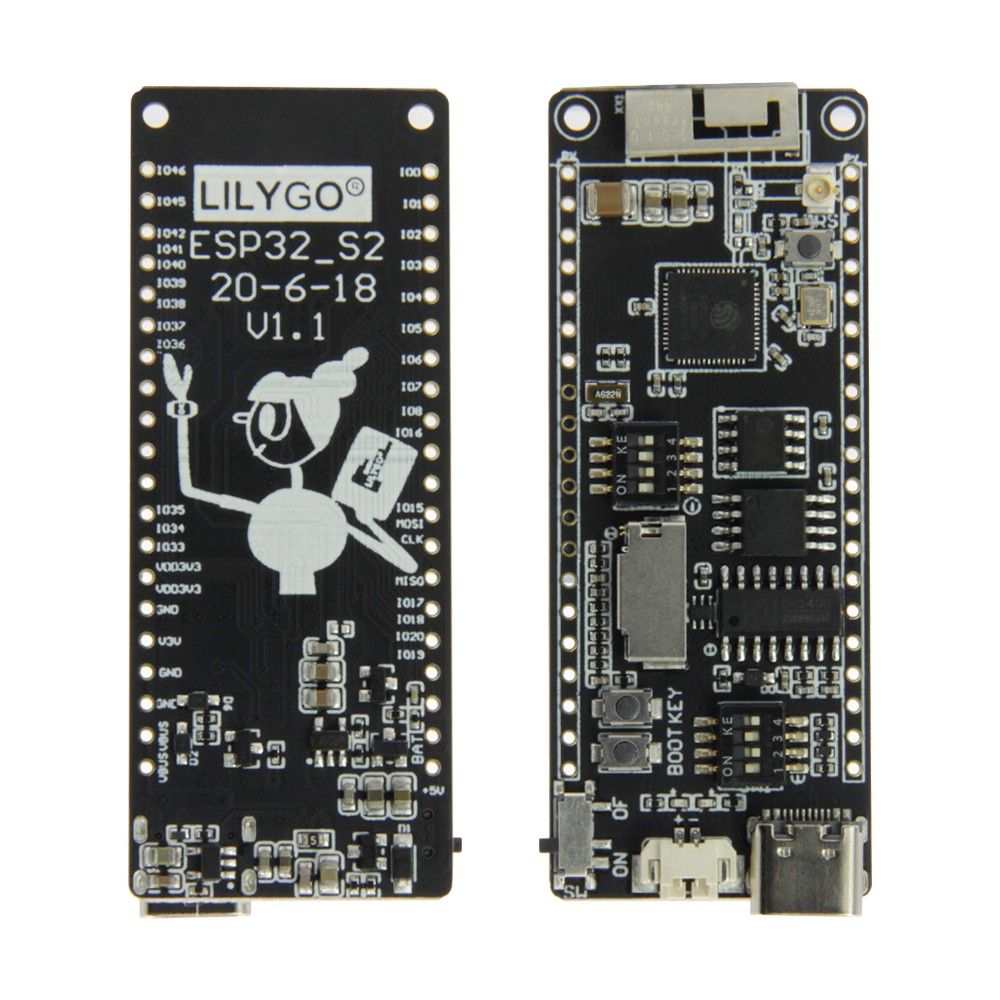
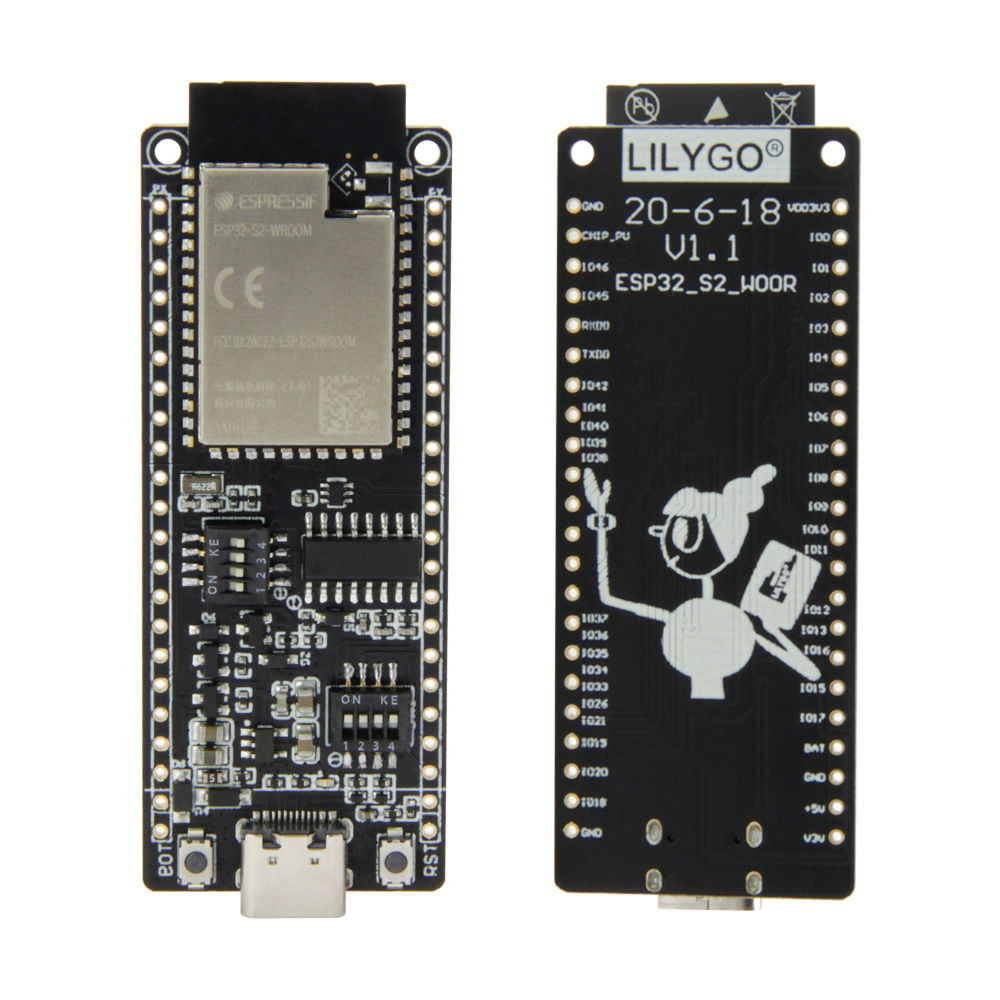
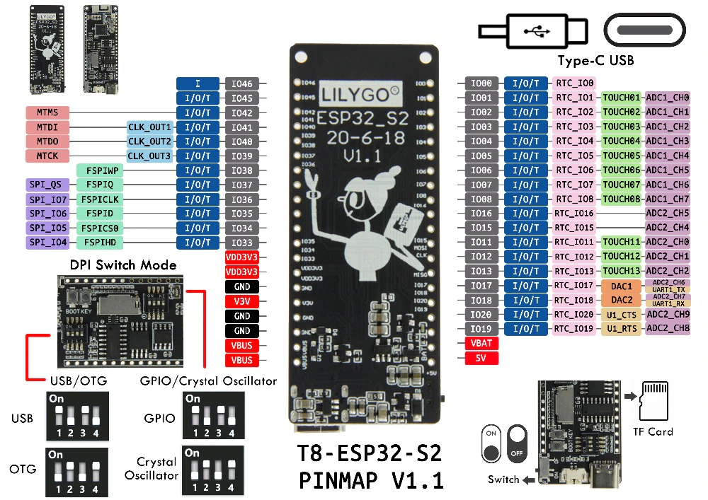
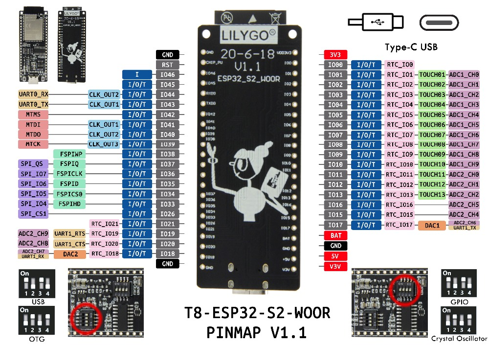
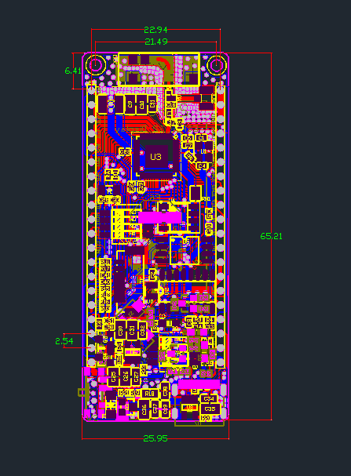
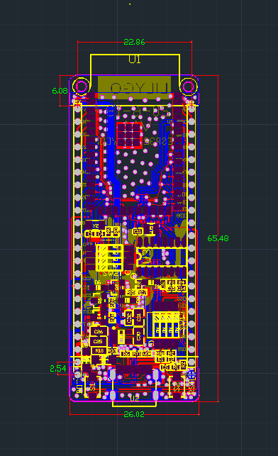

# LILYGO® TTGO T8 ESP32-S2 V1.1

Беспроводной модуль Wi-Fi, USB разъем типа C, со слотом для карт памяти TF и без него. Поддержка внешней Li-ion батареи.



### Описание продукта

Технические характеристики||
-----------:|:------------
Чипсет|ESPRESSIF-ESP32-S2
FLASH|4MB 
PSRAM|8MB
SRAM|320 kB SRAM
Кнопки|Выключатель питания, Сброс, Загрузка, Настройка, Переключатель DPI
Внешнее устройство|TF-карта
USB to TTL|CH340C
Модульный интерфейс|SD card、UART、SPI、I2C、PWM、I2S、ADC
Часовой кварц|32.768KHz
Рабочее напряжение|2.7V-3.6V
Рабочая температура|-40℃ ~ +85℃
Вес|7g
Размер|65.21*25.95*5мм
**Питание**||
Вход источника питания|USB 5V/1A
Зарядный ток|500mA
Вход батареи|3.7-4.2V
JST разъем|2Pin 1.25mm
USB|Type-C USB
**Wi-Fi**||
Стандарт|FCC/CE-RED/IC/TELEC/KCC/SRRC/NCC(esp32 chip)
Протокол|802.11 b/g/n(802.11n，speed up to150Mbps)A-MPDU and A-MSDU polymerization，support 0.4μS Protection interval
Частоты|2.4GHz-2.5GHz(2400M-2483.5M)
Мощность передатчика|22dBm
Расстояние связи|300m

## Таблица выводов



## Размеры



## Больше информации

https://github.com/Xinyuan-LilyGO/LilyGo-esp32s2-base

## Програмное обеспечение

1. Перед использованием этого проекта настройте среду ESP-IDF, конкретную ссылку [esp-idf-docs](https://docs.espressif.com/projects/esp-idf/en/latest/esp32s2/get-started/index.html)
2. Клонируйте проект, а затем выполните `idf.py build`
3. Используйте `idf.py -p [ваш порт] -b 115200 flash` для загрузки на плату


### Информация для новых пользователей:
- Если у вас есть SD-карта, откройте это определение в app_main.c строка 49
    ```
    // #define HAS_SDCARD       //If you have an SD card, please open this definition
    ```
- Вывод IO14 подключен к SD-карте платы, управление питанием светодиода - вывод IO. Когда вы используете аккумулятор, вам необходимо установить на выводе IO14 высокий уровень, чтобы использовать SD-карту.


